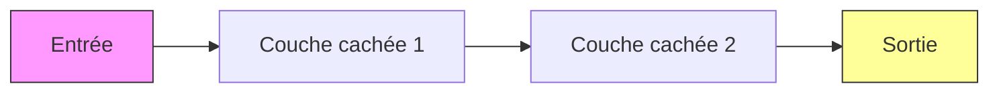

# Intelligence Artificielle, Machine Learning et Deep Learning

Une introduction aux concepts fondamentaux

<div class="pt-12">
  <span @click="$slidev.nav.next" class="px-2 py-1 rounded cursor-pointer" hover="bg-white bg-opacity-10">
    Appuyez sur Espace pour commencer <carbon:arrow-right class="inline"/>
  </span>
</div>

---
layout: two-cols
---

# Plan de la Formation

<v-clicks>

- Introduction et Histoire
  - Les origines de l'IA
  - Évolution historique
  - Les grands tournants

- L'Intelligence Artificielle
  - Définition et concepts
  - Types d'IA
  - Applications actuelles

- Machine Learning
  - Principes fondamentaux
  - Types d'apprentissage
  - Algorithmes principaux

- Deep Learning
  - Réseaux de neurones
  - Architecture
  - Applications pratiques

</v-clicks>

::right::

<div class="ml-4">

</div>

---
layout: image-right
image: https://source.unsplash.com/collection/94734566/1920x1080
---

# Les Origines de l'IA

<v-clicks>

- **1950** : Test de Turing
  - Alan Turing propose un test d'intelligence machine

- **1956** : Conférence de Dartmouth
  - Naissance officielle de l'IA
  - John McCarthy invente le terme "Intelligence Artificielle"

- **1960-1970** : Premiers succès
  - Programmes de résolution de problèmes
  - Systèmes experts

- **1980-1990** : Renaissance
  - Réseaux neuronaux
  - Apprentissage automatique

- **2010-présent** : Explosion
  - Big Data
  - Deep Learning
  - GPU puissants

</v-clicks>

---
layout: center
class: text-center
---

# L'Intelligence Artificielle

<div class="grid grid-cols-2 gap-4 mt-4">
<div>

## Définition
L'IA est la simulation de l'intelligence humaine par des machines

<v-clicks>

- Raisonnement
- Apprentissage
- Adaptation
- Résolution de problèmes

</v-clicks>

</div>
<div>

## Types d'IA

<v-clicks>

- IA Faible (ANI)
  - Tâches spécifiques
  - Ex: Siri, Alexa

- IA Forte (AGI)
  - Intelligence générale
  - Encore théorique

</v-clicks>

</div>
</div>

---
layout: default
---

# Machine Learning : Les Fondamentaux

<div class="grid grid-cols-2 gap-4">
<div>

## Types d'apprentissage

<v-clicks>

1. **Supervisé**
   - Données étiquetées
   - Classification
   - Régression

2. **Non supervisé**
   - Données non étiquetées
   - Clustering
   - Réduction dimensionnelle

3. **Par renforcement**
   - Apprentissage par essai-erreur
   - Récompenses/pénalités

</v-clicks>

</div>
<div>

## Exemple Pratique : Classification

```python
from sklearn import datasets
from sklearn.model_selection import train_test_split
from sklearn.tree import DecisionTreeClassifier

# Charger les données
iris = datasets.load_iris()
X = iris.data
y = iris.target

# Diviser les données
X_train, X_test, y_train, y_test = train_test_split(
    X, y, test_size=0.3)

# Créer et entraîner le modèle
clf = DecisionTreeClassifier()
clf.fit(X_train, y_train)

# Prédire
predictions = clf.predict(X_test)
```

</div>
</div>

---
layout: two-cols
---

# Deep Learning

<v-clicks>

## Architecture de base

- Couches de neurones
- Connexions pondérées
- Fonctions d'activation

## Applications

- Vision par ordinateur
- Traitement du langage
- Reconnaissance vocale
- Génération d'images

</v-clicks>

::right::



<v-click>

## Exemple : CNN pour la vision

```python
import tensorflow as tf

model = tf.keras.Sequential([
    tf.keras.layers.Conv2D(32, 3, activation='relu'),
    tf.keras.layers.MaxPooling2D(),
    tf.keras.layers.Flatten(),
    tf.keras.layers.Dense(10, activation='softmax')
])
```

</v-click>

---
layout: center
---

# Cas Pratiques et Applications

<div class="grid grid-cols-3 gap-4">
<div>

## Santé
<v-clicks>

- Diagnostic médical
- Analyse d'images
- Découverte de médicaments

</v-clicks>
</div>
<div>

## Finance
<v-clicks>

- Détection de fraude
- Trading algorithmique
- Évaluation des risques

</v-clicks>
</div>
<div>

## Transport
<v-clicks>

- Véhicules autonomes
- Optimisation de trajets
- Maintenance prédictive

</v-clicks>
</div>
</div>

---
layout: end
---

# Questions ?

[Documentation](https://example.com) · [Ressources](https://example.com) · [Contact](mailto:contact@example.com)